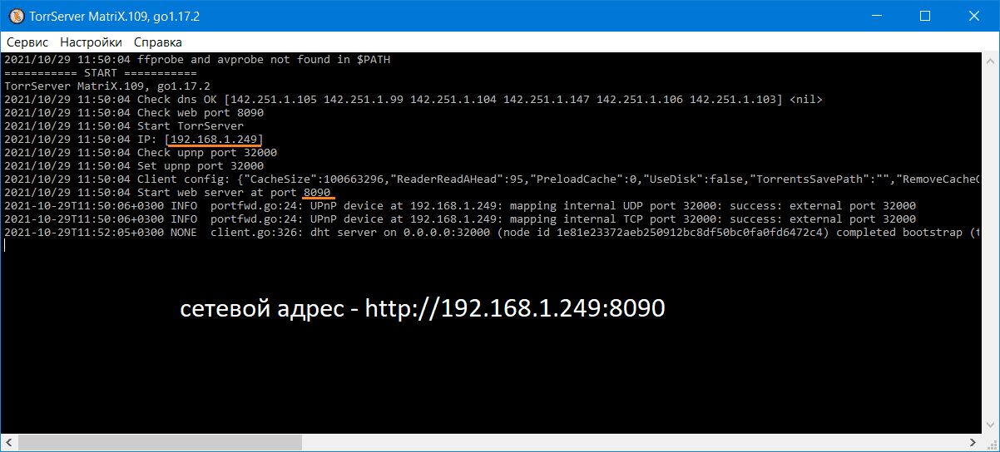

# TSL - лаунчер для TorrServer под Windows  
Позволяет сворачивать консольное окно торрсервера в трей. Есть автозапуск при входе в систему. Работает с любой версией сервера.  
#### Использование:  
В папку с исполняемым файлом торрсервера ( TorrServer-windows-\*\*\*.exe ) положить [**tsl.exe**](https://github.com/Noperkot/TSL/releases/latest/download/tsl.exe) и запустить его - торрсервер стартует в свернутом в трей виде (иконка рядом с часами в правом нижнем углу экрана). При желании можно включить автозапуск.  

_( Последнюю версию TorrServer можно взять здесь: [x32](http://releases.yourok.ru/torr/server/TorrServer-windows-386.exe), [x64](http://releases.yourok.ru/torr/server/TorrServer-windows-amd64.exe) )_  
#
Для ленивых готовый пак: **лаунчер + TorrServer MatriX.109 (x32 и x64)**  
Просто распаковать архив [**TorrServer109_with_TSL14.zip**](https://github.com/Noperkot/TSL/releases/download/1.4/TorrServer109_with_TSL14.zip), войти в папку TorrServer и запустить tsl.exe.  

Для работы с сервером можно использовать любой MatriX-совместимый TorrServe клиент, в том числе расширение для браузеров **TorrServer Adder** ( [Chrome](https://chrome.google.com/webstore/detail/torrserver-adder/ihphookhabmjbgccflngglmidjloeefg?hl=ru), [Firefox](https://addons.mozilla.org/ru/firefox/addon/torrserver-adder/) ).
#
Обсуждение TorrServer'а и всего что с ним связано:
- [на 4PDA](https://4pda.to/forum/index.php?showtopic=889960)
- [в Telegram](https://t.me/TorrServe)
#
  
  
