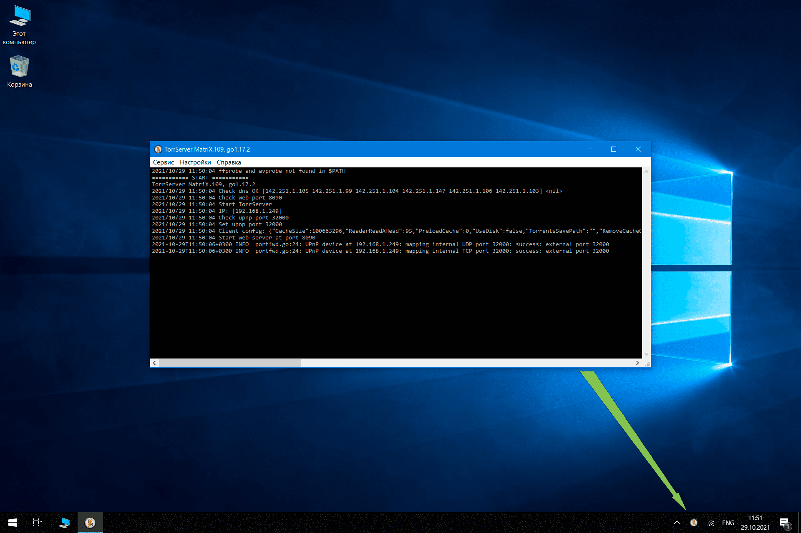

# TSL 1.6.0  
### Лаунчер для [TorrServer](https://github.com/YouROK/TorrServer) под Windows  
Позволяет сворачивать консольное окно торрсервера в трей. Есть автозапуск при входе в систему. Работает с любой версией сервера.  
#### Использование:  
[**tsl.exe**](https://github.com/Noperkot/TSL/releases/latest/download/tsl.exe) положить папку с исполняемым файлом торрсервера ( TorrServer-windows-\*\*\*.exe ) и запустить его. Торрсервер стартует свернутым в трей (иконка рядом с часами в правом нижнем углу экрана). При желании можно включить автозапуск.  

_( Последнюю версию TorrServer под вашу архитектуру можно взять [здесь](https://github.com/YouROK/TorrServer/releases) )_  

***
Для ленивых [**инсталлятор**](https://github.com/Noperkot/TSL/releases/latest/download/TorrServer_MatriX.109_setup.exe) (TorrServer MatriX.109 + лаунчер) 

Для работы с сервером можно использовать любой MatriX-совместимый TorrServe клиент, в том числе расширение для браузеров **TorrServer Adder** ( [Chrome](https://chrome.google.com/webstore/detail/torrserver-adder/ihphookhabmjbgccflngglmidjloeefg?hl=ru), [Firefox](https://addons.mozilla.org/ru/firefox/addon/torrserver-adder/) ).
***
Обсуждение TorrServer'а и всего что с ним связано:
- [на 4PDA](https://4pda.to/forum/index.php?showtopic=889960)
- [в Telegram](https://t.me/TorrServe)
***

Скриншоты
  

  

  

